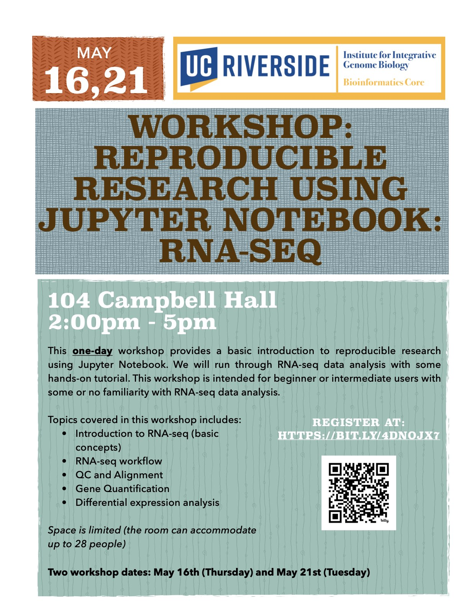

# RNA-Seq-Workshop

<figure>

</figure>

This one-day workshop will provide a basic introduction to RNA-seq data analysis with some hands-on tutorials using Jupyter Notebook for reproducible research. This workshop is intended for beginner or intermediate users with some or no familiarity with RNA-seq data analysis.  

Topics covered in this workshop includes:

- Introduction to RNA-seq (basic concepts)
- RNA-seq workflow
- Quality control
- Sequence Alignment
- Gene Quantification
- Data Pre-processing
- Differential expression analysis

# General Information  
**Date:** May 16, 2024 and May 21, 2024
**Time:** 2PM - 5PM  
**Location:** 104 Campbell Hall  
**Format:** In-Person

# Registration
Register for the workshop at: https://bit.ly/4dnOjx7

# Requirements
Attendees should have a laptop (Mac or PC) to follow along in the workshop. If you don’t have a laptop, you can check one out at the [Tomas Rivera](https://library.ucr.edu/libraries/tomas-rivera-library) or [Orbach Science Library](https://library.ucr.edu/libraries/orbach-science-library). Go to the library circulation desk for more information.

**Mac Users:** The MacOS have a built-in terminal program for the command line interface and requires no additional software installation.

**PC Users:** Windows users can install the [MobaXterm](https://mobaxterm.mobatek.net/) for Windows terminal app
