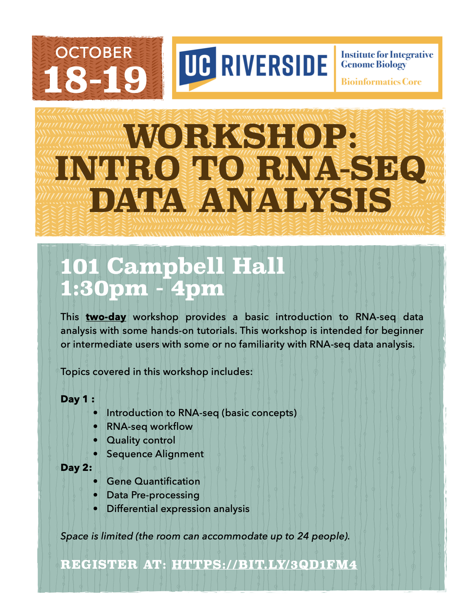

# RNA-Seq-Workshop

<figure>

</figure>

This two-day workshop provides a basic introduction to RNA-seq data analysis with some hands-on tutorials. This workshop is intended for beginner or intermediate users with some or no familiarity with RNA-seq data analysis.

Topics covered in this workshop includes:

Day 1 :

- Introduction to RNA-seq (basic concepts)
- RNA-seq workflow
- Quality control
- Sequence Alignment

Day 2:

- Gene Quantification
- Data Pre-processing
- Differential expression analysis

# General Information  
**Date:** October 18-19, 2023  
**Time:** 1:30PM - 4PM  
**Location:** 101 Campbell Hall  
**Format:** In-Person

# Registration
Register for the workshop at: https://bit.ly/3Qd1Fm4

# Requirements
Attendees should have a laptop (Mac or PC) to follow along in the workshop. If you don’t have a laptop, you can check one out at the [Tomas Rivera](https://library.ucr.edu/libraries/tomas-rivera-library) or [Orbach Science Library](https://library.ucr.edu/libraries/orbach-science-library). Go to the library circulation desk for more information.

**Mac Users:** The MacOS have a built-in terminal program for the command line interface and requires no additional software installation.

**PC Users:** The WinOS does not automatically come with a terminal/shell system pre-installed. For Windows 10 and 11 users, you can follow the instructions in this [link](https://itsfoss.com/install-bash-on-windows/) to install the Linux Bash Shell onto your system.
